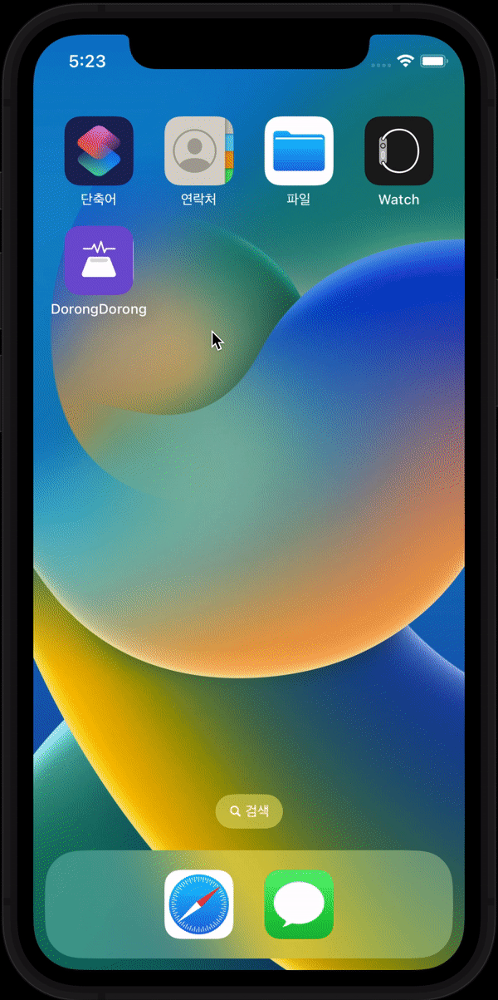
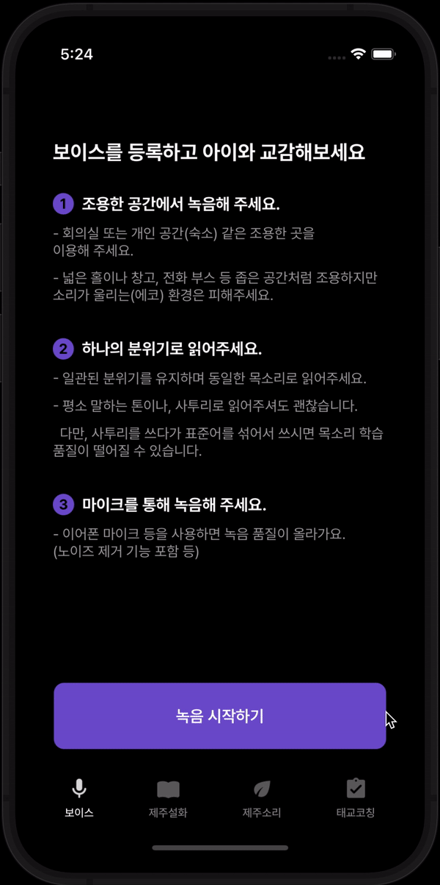
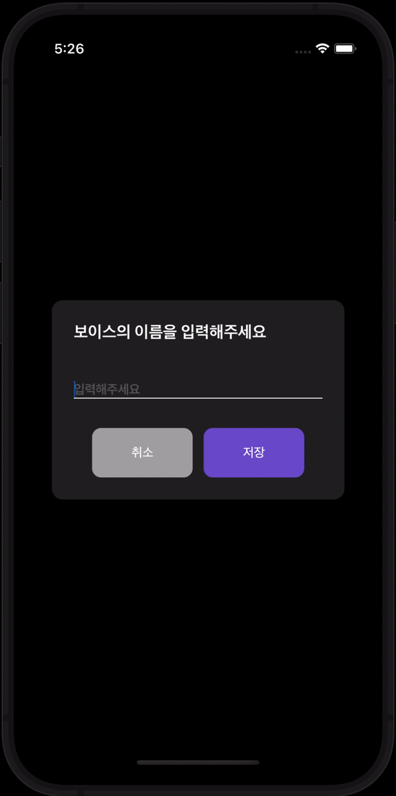
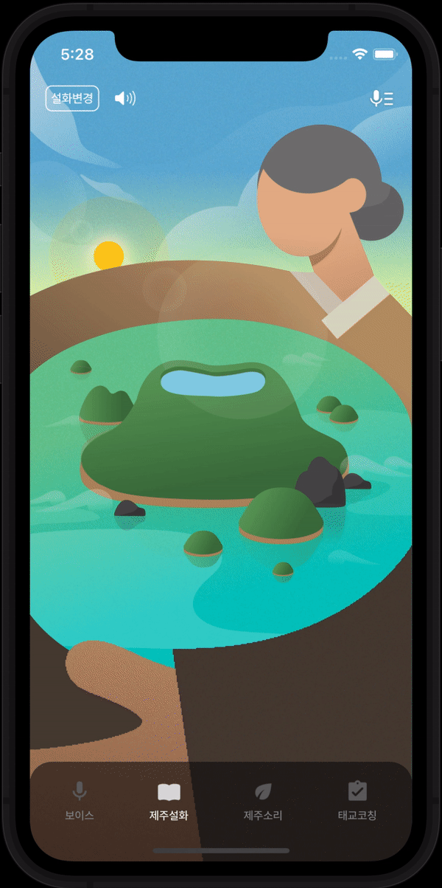
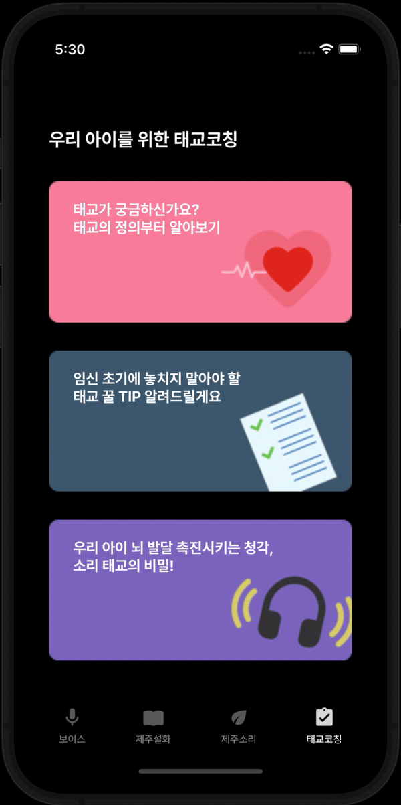

# DorongDorong - 대상 🏆
</a>&nbsp;
</a>&nbsp;

</br>


## 👨‍👩‍👧‍👦 Team
<div align="center">
  <table style="font-weight : bold">
      <tr>
          <td align="center">
              <a href="https://user-images.githubusercontent.com/48436020/202971874-c64710fc-25e7-4e9a-bdc0-8265921417fd.png">                 
                           
              </a>
          </td>
          <td align="center">
              <a href="https://user-images.githubusercontent.com/48436020/202972229-8d3534bd-8455-44b0-832f-10075225d841.png">                 
                              
              </a>
          </td>
          <td align="center">
              <a href="https://github.com/GeonHyeongKim">                 
                              
              </a>
          </td>
          <td align="center">
              <a href="https://github.com/younhwan97">                 
                              
              </a>
          </td>
          <td align="center">
              <a href="https://github.com/ChoiSunPil">                 
                              
              </a>
          </td>
      </tr>
      <tr>
          <td align="center">우승우(PM)</td>
          <td align="center">전예진(Designer)</td>
          <td align="center">김건형(iOS)</td>
          <td align="center">조윤환(AOS)</td>
          <td align="center">최선필(BE)</td>
      </tr>
  </table>
</div>
<br/>

## 💡 About Project
> PERSONA : 태교여행을 가고 싶어도 가지 못하는 임산부를 위한 태교 서비스
```
- 기존에 제주도를 다녀온 임산부나, 제주도를 가고 싶어하는 임산부를 위해 ‘여행’이라는 추억을 공유해주는 청각∙시각 활용 서비스
- 임신은 모두가 처음이기 때문에, 도와주기 위한 TIP들을 제공
```

> WHY : 왜 태교 서비스인가?
```
💡 태교란, "임산부의 행동이 태아에게 심리적, 정서적, 신체적으로 영향을 미친다는 것을 근거로 하여 임신 중에 태아에게 좋은 영향을 주기 위해 언행을 삼가며 태아가 자라나기 위한 준비를 더욱 잘 할 수 있도록 좋은 환경을 만들어 주고자 하는 임신 중 교육”
- #제주 : ‘힐링’이라는 주제로 태교를 위한 간접 제주도 경험 제공
- #교육 : 제주도라는 지역에 태교여행을 하고 싶지만, 하지 못하는 임산부들을 위해 마련된 서비스
- #클라우드 : AWS, TTS API(구현 X)
```

> WHO : 타겟이 왜 임산부인가?
```
💡 교육이란, 주체도 사람, 객체도 사람인 개념
사실상 우리나라 조기교육의 시작점은 태교부터라고 생각
태교를 통해 아이의 정서적 발달이 시작되기에 이번 구름톤 #교육이라는 취지에 가장 걸맞음
```
    
> WHERE : 왜 제주도인가?
```
💡 제주도라는 지역적 명소가 주는 ‘힐링’이라는 의미를 전달하기 위해
```
    
> HOW : 핵심 기술 스택과 정의가 무엇인지?
```
# 소리 : 가보고 싶던, 갔다왔던 제주에 대한 자연의 소리
# 전래동화 : 아이에게 들려주고 싶은 제주도만 전래동화
# 음성합성서비스 : 태아가 가장 편안함을 느끼는 부모의 소리 전달(구현 X)
```
<br/>

## 📱 ScreenShots
<Blockquote>
실제 앱 구동화면입니다
</Blockquote>

|  |  |  | |
| :-: | :-: | :-: | :-: |
| 스플래쉬 | TTS 등록1 | TTS 등록2 |  |
|  |  |  |  |
| 제주 설화  | 목소리 선택/등록 | 제주 소리 | 태교 코칭 |
<br/>

## 🏃 Intallation
1. 개별적으로 DorongDorong/Source/Network/APIConstants.swift 세팅을 진행해주세요.
    ```swift
    struct APIConstants {
        static let url = "http://\(AWS Public 주소)"
    }
    ```
    * AWS Public 주소 : geonhyeong.dev@gmail.com로 문의 부탁드립니다.
    
2. `Podfile` 파일에 아래 코드가 잘 입력되어 있는지 확인해주시고, 안 되어 있다면 추가해주세요
    ```sh
      pod 'lottie-ios'
      pod 'SwiftKeychainWrapper'
      pod 'Alamofire'
      pod 'Introspect'
      pod 'URLImage'
    ```

3. pod을 설치하세요
    ```sh
    $ cd your-project-directory
    ```
    ```sh
    $ pod install
    ```
4. .xcworkspace파일을 열어서 앱을 실행하실 수 있습니다.
<br/>

## ⚙️ Environment
- iOS 15.0 이상
- iPhone Xs, iPhone 11 Pro, 아이폰 12 mini 에서 최적화됨
- 가로모드 미지원, 다크모드 미지원
<br/>

## 🔥 Technical Achievements
### iOS 사이드
- TTS 등록을 위한 자동으로 글이 넘어가는 방식
  ```swift
  Lyric(lyric: "햇살도 둥글둥글하게 뭉치는 맑은 날", isBlur: true, isEnd: false, time: 4)
  ```
  가사(글)을 Model화시킨 후, `.onReceive`와 `timer(Timer.publish)`를 통해 시간 계산후, view를 update 했습니다.

- 서버에서 받은 음성을 비동기 처리하는 과정
  AVAudioPlaye를 `play()`하기 전에 서버에서 받아온 `URL`를 Data로 변경하고 `Data`를 `AVAudioPlayer(data: data)`를 통해 초기화해야합니다.
  ```swift
  DispatchQueue.global().async {
    do {
      let data = try Data(contentsOf: audio)
      DispatchQueue.main.async {
        do {
          self.audioPlayer = try AVAudioPlayer(data: data)
          self.audioPlayer.delegate = self
          self.audioPlayer.play()
        } catch {
          print("재생 실패")
        }
      }
    } catch {
      print("m4a Data화 실패")
    }
  }
  ```
  를 통해 값을 초기화 처리했습니다.<br/>
  또한, View 전환시 onAppear, onDisappear 통해 값을 초기화하고, 등록하는 과정을 거쳤습니다.
<br/>

## 👣 Review
- PM : 우리팀 디자이너 (진)카카오
- Designer : 여러분~! 너무 고생많으셨고 제 디자인 좋아해주시고, 움직여 주셔서 감사합니다 😀!
- iOS(me) : 내가 대상탄다 했지!!
- AOS : 구글과 애플이 뭉치면 세상을 지배한다!
- BE : 우리 모두 앞으로도 이 기억으로 파이팅!
